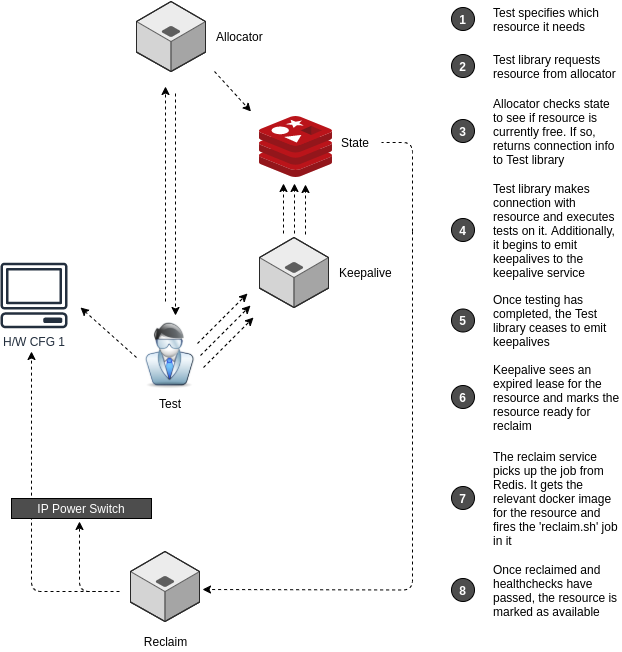

automation-infra
================

## architecture

**Caveat: This project is in it's infancy and as such design decisions are subject to change.*

The first phase of this project will use the following architecture:

### Allocator

The allocator will be responsible for allocating hardware to a request. It will check it's state to see if the desired hardware is free (not currently locked by another test job). If the requested hardware is not free, the Allocator will return an error - the client should retry after 20s. If the requested hardware is free, the Allocator will return connection details for that device and will mark the resource as locked.

### Keepalive

As the user is using the requested resource, a keepalive will be sent to a service to persist it's locked state, ensuring other users can not book it.

### Logs

All service logs will be output into docker stdout/stderr

### Metrics

We will run prometheus node exporter on the host

## Load

- Keepalive should be tested to 200 QPS
- Allocator should be tested to 20 QPS

## Communications

For service-to-service communications we use asyncio

## Service Orchestration

For now we are using docker-compose to manage service orchestration. This will be tested on a Ubuntu 18.04 (bionic) distro.

Docker images will use an alpine base

## Phase 1 : Out of Scope

In Phase 1 the following items are out of scope:

- [ ] Multiple hardware configurations. This build will orchestrate workloads onto a single hardware configuration
- [ ] A production database. This phase will use a static configuration file. It is assumed the IP address of the devices will not change.
- [ ] Cleaning the hardware after use. This phase will not handle re-flashing devices
- [ ] Device health checks. This phase will not perform healthchecks
- [ ] Dedicated internal hardware. This phase will run off a team-members machine (rather than live as a service on a box accessible by the entire office)
- [ ] Robust access management

