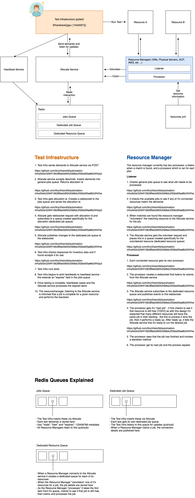
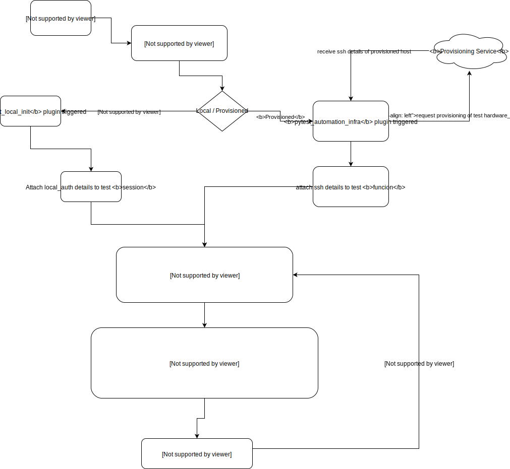

automation-infra
================

#### Set Up:

Directory Structure and pythonpath calculation:
All repos will be parallel to automation-infra repo.
They will have folder called automation which will be added to pythonpath automatically. Imports should be relative to that.
Inside automation folder will be another folder with the same name as the base repo (- replaced with _), and inside that relevant folders (plugins, utils, etc).

First clone this repo, and run ./run_tests.sh, this should pass, this means the repo and requirements are set up properly.

After that, in addition you should probably clone the following repos:

**devops-automation-infra**: git@github.com:AnyVisionltd/devops-automation-infra.git<br>
**camera_service**: git@github.com:AnyVisionltd/camera-service.git<br>
**pipeng**: git@github.com:AnyVisionltd/pipeNG.git

(Make sure the repos have the subfolder automation/[repo_name]/... otherwise you need to checkout branch hab/automation_infra)

So for example the directory structure:
```
automation-infra
    automation  # <- sources root / pythonpath
        automation_infra
            plugins
                ssh.py
            utils
                util1.py
            tests
                test_example.py
devops-automation-infra
    automation  # <- sources root / pythonpath
        devops-automation_infra
            plugins
                memsql.py
                seaweed.py
            utils
                util1.py
            tests
                test_example.py
camera_service
    automation  # <- sources root / pythonpath
        camera_service
            plugins
                camera_service.py
            utils
                cs_util.py
            tests
                test_sanity.py
pipeng
    automation  # <- sources root / pythonpath
        pipeng
            plugins
                pipeng.py
            utils
                pipeng_util
            tests
...
```
And then the imports would be:
```
from automation_infra.plugins.ssh import SSH
from pipeng.plugins.pipeng import Pipeng
from camera_service.utils import cs_util
```
In addition, should be a yaml file in $HOME/.local/hardware.yaml which has similar structure to:
```
host:
    ip: 0.0.0.0
    user: user
    password: pass
    key_file_path: /path/to/pem # see note below: 
```
*key_file_path and password are mutually exclusive so use only 1 type of auth

make
----

A makefile has been provided for your convenience. Simply run `make` to see a
list of possible commands.

pipenv
------

If you have pipenv installed you can enter this environment with:

```sh
make shell
```

tests
-----

You can run all tests with:

```sh
make tests
```

You can run all generic linters:

```sh
make lint
```

You can run individual analysis using:

```sh
make test-complexity      # run only complexity analysis
make test-security        # run only security analysis
make test-lint-python     # run only pylint
make test-lint-shellcheck # run only shell/bash linter
make test-lint-docker     # run only docker linter
```

### hwprovisoner architecture



Flow Diagram:



